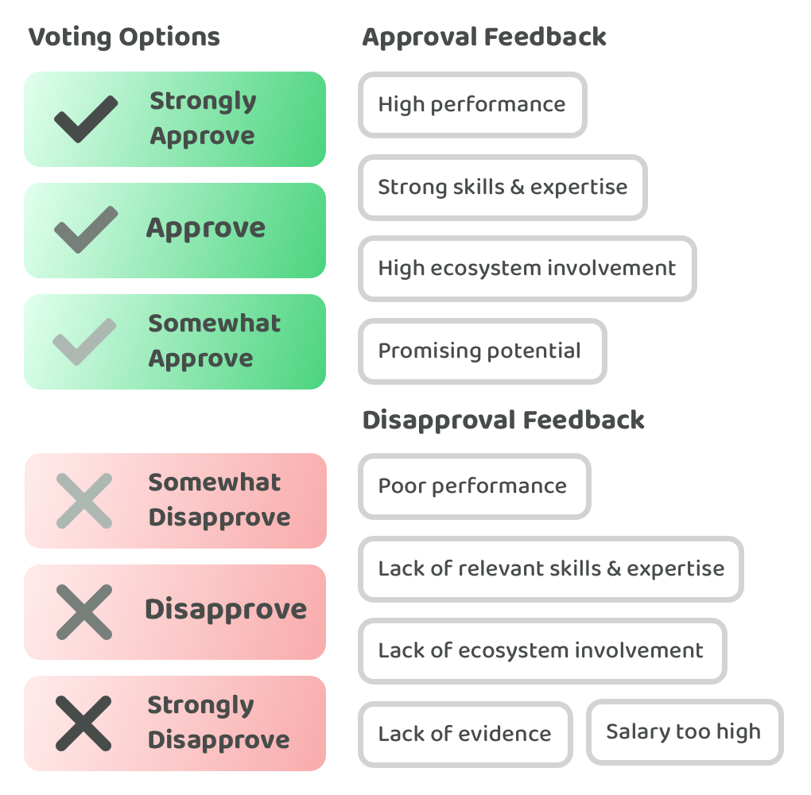

# Voter guide

Voters are responsible for selecting the most promising contributors that could generate the most impact for the ecosystem. Voters will need to read and compare a number of contributor proposals to make an informed decision about who they are going to select during voting.

**Expressive approval voting**

Approval voting is where voters can approve as many proposal as they like. The voters full voting power is applied when they approve any proposal. The proposals with the most approvals wins the vote. Expressive approval voting will be used for this contributor funding experiment. Expressive approval voting is an adaptation of approval voting.

<figure><figcaption></figcaption></figure>

The main differences with expressive approval voting compared to approval voting are as follows:

* **Added disapproval option** - A disapproval option is added however when a voter selects this option it will not apply any voting power. A disapproval option is only available so that voters can express their disapproval of a proposal. This voting option can help with providing more feedback to proposers and also more insightful information for the community to consider.
* **Added confidence variants** - Approval and disapproval options will be split into three different confidence variants. For approval options these will include ‘Strongly approve’, ‘Approve’ and ‘Somewhat approve’. For disapproval options these will include ‘Somewhat disapprove’, ‘Disapprove’ and ‘Strongly disapprove’. Voters will now be able to express the confidence they have in their decisions. Selecting any of the approval options results in the same outcome - the voters full voting power will be applied and they are approving the proposal. Disapproval votes enable voters to express dissent however these votes would not lead to any change in the decision outcome as the voting power would not be applied. Disapproval voting options are only added to provide proposal feedback.
* **Added feedback options** - A list of suggested feedback responses are provided for the voter to consider. The voter can select the feedback option that most strongly aligns with the reason they are approving or disapproving the proposal. Voters can only select one of the suggested feedback options. The voter will also be able to give more specific feedback in a separate feedback box if they want to. The suggested approval and disapproval feedback options are described in more detail below.
* **Added decision disapproval option** - A voter is able to disapprove of the entire set of proposals. A voter may want to do this if they disagree with the decision being made or they believe the quality of the submitted proposals is not high enough. A decision disapproval outcome could then either be abandoned entirely or the decision process could be repeated when higher quality proposals get submitted.
* **Victory condition additional factors** - The approval confidence variants can be used as an additional victory condition factor in situations where there is a tie between proposals that receive the same amount of voting power. In these situations the confidence variants can be used as a secondary factor to determine which proposals the voters have the highest confidence in selecting. The disapproval voting options will still have no impact on the outcome of the decision.

Approval feedback option descriptions:

* **High performance** - Contributor is a high performer. Evidence demonstrates innovative or novel contributions, strong leadership, history of generating impactful outcomes or strong ability to make high quality contributions.
* **Strong skills & expertise** - Contributor has highly relevant skills & expertise. Evidence could demonstrate expertise around architecture, tools or software, strong technical leadership or that they have highly relevant skills or qualifications.
* **High ecosystem involvement** - Contributor has been highly involved in the ecosystem. Evidence could demonstrate they are highly familiar with the community and culture or that they have already been actively contributing towards projects in the ecosystem.
* **Promising potential** - Contributor has promising potential in the ecosystem. Evidence provided might not be fully convincing at this stage. Enough evidence has been provided to demonstrate promising potential.

Disapproval feedback option descriptions:

* **Poor performance** - Contributor has demonstrated poor historical performance. Example areas of concern could be around their contribution outcomes, communication skills, work ethic, cultural alignment, ecosystem involvement or their overall professionalism.
* **Lack of relevant skills & expertise** - Contributor does not have sufficient skills or expertise for the role. Large amounts of support might be needed. There is a risk that it could take a long time for the contributor to learn the required skills to meaningfully contribute.
* **Lack of ecosystem involvement** - Contributor has not been actively involved in the ecosystem. The contributor might have a lack of understanding about the ecosystem, how it operates and how projects are being developed. There also could be concerns around cultural fit.
* **Lack of evidence** - Contributor has not provided sufficient evidence to demonstrate their potential. The evidence currently provided does not sufficiently demonstrate their skills & expertise, ecosystem involvement or historical performance.
* **Salary too high** - The salary requested by the contributor is too high. The evidence provided by the contributor does not support the salary expectations they have.

**Contributor proposal feedback**

After the contributor proposals have been submitted the voters and wider community will be invited to provide any feedback and suggestions they have about the proposals. Contributors can then consider the suggestions and feedback provided before making any final changes to their proposal. Suggestions and feedback will be provided as comments on the proposal pull request.

**Voting process**

A Google Sheet will be created that has all of the contributor candidate proposals listed in the document. All of the voting and feedback options will be available for each candidate as well as a decision disapproval option.

1. Register with the fund operator to receive a voter ID. The voting form will require a voter ID for the voting submission to be valid.
2. Review the contributor candidate proposals and then duplicate and fill in the following contributor candidate selection [Google Sheet](https://docs.google.com/spreadsheets/d/1\_zcD70njyQFBaA6qXIIfudS1hEhlMo3zZ5035py3Nwg/edit?usp=sharing).
3. Once completed, download the Google Sheet as a Microsoft Excel file (.xlsx).
4. Submit your voter ID and the Microsoft Excel file in the [contributor selection submission form](https://docs.google.com/forms/d/e/1FAIpQLScX0G8ks6V\_lm0\_EY9MBF5ayIs6HKidqc0if4gsZXrKz-hCuQ/viewform). Do not complete this form more than once as this will invalidate your vote.
5. After the submission deadline the votes will be aggregated and the voting results will then be shared publicly. Votes will remain anonymous.
